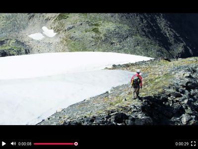

# Верстаем видеоплеер

Верстаем видеоплеер с нуля. Добавляем иконки, используем Flexbox.

Посмотреть вживую: <https://romanvolodin.github.io/dvmn_player_layout/>



## Как развернуть dev версию

Скачайте код с GitHub. Установите зависимости:

```sh
pip install -r requirements.txt
```

Запустите сервер, чтобы вручную не обновлять страницу браузера после каждого изменения в коде.

```sh
livereload
```

По-умолчанию сервер запускается по адресу <http://127.0.0.1:35729>. Откройте его в браузере и увидите страницу с плеером. Остановить сервер можно командой `Ctrl+C`.

## Цели проекта

Код написан в учебных целях — для курса по Python на сайте [Devman](https://dvmn.org/modules/django-layout/).
