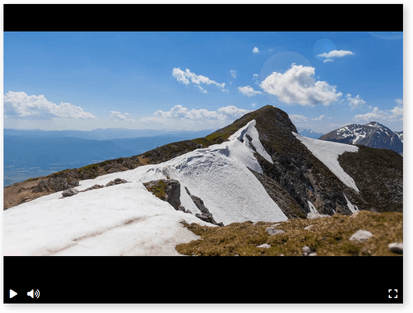

# Верстаем видеоплеер

Верстаем видеоплеер с нуля. Добавляем иконки, используем Flexbox.

Посмотреть вживую: <https://romanvolodin.github.io/dvmn_player_layout/>

## Цели проекта

Код написан в учебных целях — для курса по Python на сайте [Devman](https://dvmn.org/modules/django-layout/).
